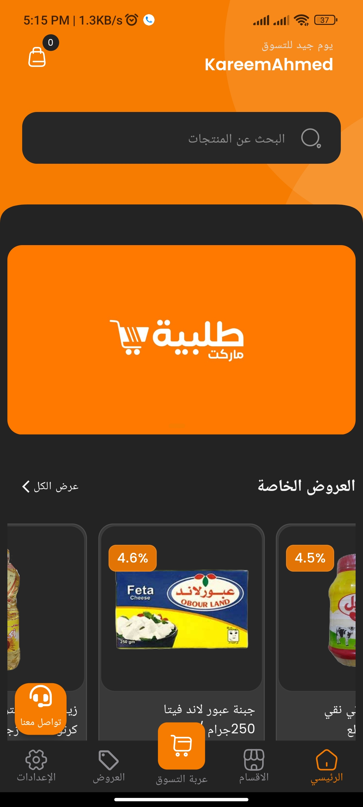

<!-- PROJECT LOGO -->
 

  <h3 align="center">(
طلبية ماركت-talabia-markit)</h3>

  

A wholesale food app offering bulk products at special prices with easy, high-quality shopping.  

<!-- ABOUT THE PROJECT -->
## About The Project
“Talaba Market” is a wholesale application for food products, where you can find a variety of products at special prices and in large quantities. Enjoy a comfortable shopping experience and get what you need with ease and high quality.

 ## Available on Google Play:
  - Download the app from Google Play: [طلبية ماركت on Google Play](https://play.google.com/store/apps/details?id=com.kareem_ahmed_mahmoud_abed.talabiat)

## Features

### talabia-Markit Enhance shopping experience

- **Exclusive Product Selection**:
  - Access a wide variety of food products at special wholesale prices, ideal for bulk purchases.
  - Ensure a curated selection of high-quality items for a convenient shopping experience.

- **Effortless Shopping**:
  - Simplify the purchasing process with easy navigation and a user-friendly interface.
  - Enjoy a quick and efficient shopping experience with a focus on customer satisfaction and value.

<!-- USAGE EXAMPLES -->
## photos

 

  
  

## Video

 

  
<video width="630" height="300" src="https://github.com/kareem-Abed/QuizMaster/assets/130121946/07d708b8-7aae-4ea3-90b4-ff0bb0187c9c"></video>

<!-- CONTACT -->
## Contact

 

 

    

